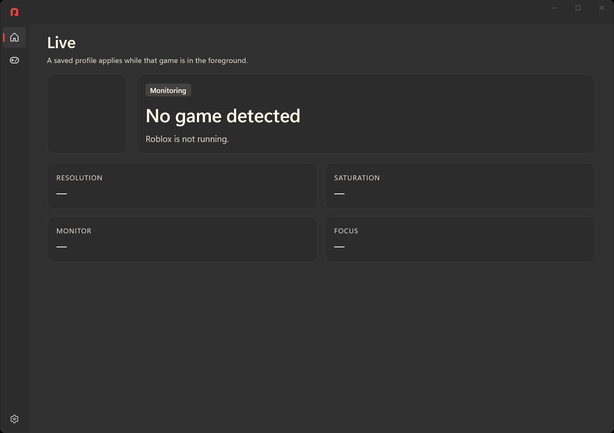
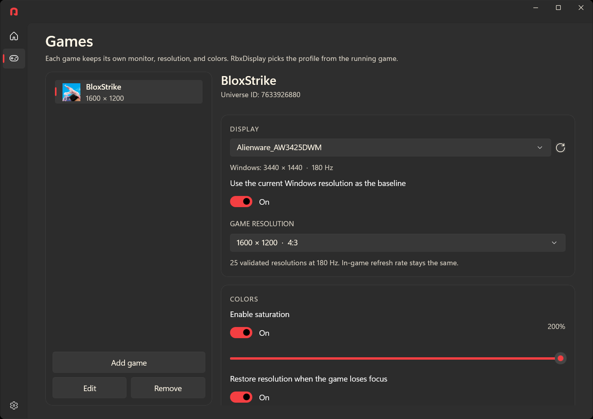

> [!IMPORTANT]
> RbxDisplay 2.0.1 runs on 64-bit Windows 10, version 2004 (May 2020) or newer, and on 64-bit Windows 11.

> [!NOTE]
> RbxDisplay is updated in spare time, so a fix can take a while. Report every bug or other problem in [Issues](https://github.com/pixelbayplebs/Stretcher/issues).

<p align="center">
    
</p>

----

RbxDisplay remembers a display setup for each Roblox game. While that game is the window in front, it applies that game's monitor, everyday resolution, game resolution, color, and Alt+Tab behavior. When you leave the game, it puts the display back.

It sees which game you joined by reading Roblox's own log. **Play** opens the game link saved for that setup.

How to use the window, the game list, and recovery is in [USAGE.md](USAGE.md). Building the app yourself is optional and is described in [BUILD.md](BUILD.md). For a bug or any other problem, open an [issue](https://github.com/pixelbayplebs/Stretcher/issues).

**Live** shows whether a saved game is the window in front, and which setup is applied.

<p align="center">
    
</p>

**Games** is the saved list. Each game keeps its own monitor, resolution, and color.

<p align="center">
    
</p>

RbxDisplay runs on Windows only.

## Frequently Asked Questions

**Q: Is this malware?**

**A:** No. The source code is on this page, and the files on Releases are built from it. RbxDisplay changes Windows display settings while a saved Roblox game is in front, then restores them. It reads Roblox's log to see which game you joined. It does not change the Roblox client, inject code into it, or read the game's memory.

**Q: Can using this get me banned?**

**A:** RbxDisplay changes your monitor settings in Windows and reads Roblox's log. It does not modify the Roblox client. Roblox still applies its own rules. This is not a promise that an account cannot be punished.

## Features

- Each game keeps its own setup: which monitor, your everyday resolution, the resolution for that game, color strength, and what happens when you switch away. BloxStrike is included (Place ID `114234929420007`) and can be removed.
- The setup follows the game you are in. **Play** opens the Roblox place saved for it. Add a game with a name and a Place ID, or paste a `roblox.com/games` link.
- The resolution list only includes modes your monitor reports and Windows accepts, at the same refresh rate as your everyday picture. RbxDisplay keeps that refresh rate. If a saved game resolution is missing from the list, it leaves the choice empty until you pick one that is there.
- Color is saved per game, from 0% to 200%. **100%** is normal color. While that game is in front, the color change covers the whole desktop, on every monitor.
- Color comes back when the game is no longer the front window. The game resolution stays until you leave the game, unless **Restore resolution when the game loses focus** is on.
- **Ctrl+Alt+F12** puts the display back at once. RbxDisplay stays open. That game's setup stays off until you leave the game or the game closes. If RbxDisplay closes unexpectedly, `RbxDisplay.Watchdog.exe` puts the display back. Closing RbxDisplay yourself also puts back a display it changed.
- **Test for 15 seconds** shows a setup before you join. **Minimize to tray** hides the window. Click the RbxDisplay icon by the clock to open it. Right-click that icon for Open, Restore display, or Exit.

## Installing

1. Open the [latest release](https://github.com/pixelbayplebs/Stretcher/releases/latest).
2. Under **Assets**, download **`RbxDisplay-2.0.1-win-x64.zip`**. That zip is the program. The links named **Source code** are the project files, not the app. Leave those alone.
3. Right-click the zip and choose **Extract All**. A good place is Downloads or the Desktop. Windows makes a folder from the zip. Open that folder.
4. Leave every file in the folder together: `RbxDisplay.exe`, `RbxDisplay.Watchdog.exe`, the DLL files, and the `Assets` folder. Start `RbxDisplay.exe` from this folder. Opening it from inside the zip window leaves the other files behind, and the app cannot run that way.
5. The PC needs the 64-bit .NET Desktop Runtime 10. If a window says the app cannot start and asks for .NET, open the [.NET 10 download page](https://dotnet.microsoft.com/download/dotnet/10.0), download **Desktop Runtime** for **x64**, install it, and start `RbxDisplay.exe` again.
6. The first time you open `RbxDisplay.exe`, Windows can show a blue window titled **Windows protected your PC**. The text says Microsoft Defender SmartScreen prevented an unrecognized app from starting. Publisher is **Unknown publisher**. The button on the window is **Don't run**.

   Windows shows this because the zip was downloaded from the internet, and because this release is not signed. A download is marked as coming from the web. An unsigned program has no publisher certificate, so SmartScreen cannot name who made it and has no reputation for the file yet. It stops the program until you allow it. The heading and the line about risk are the standard text for that case. They appear for other new programs in the same situation.

   Click the **More info** link. A **Run anyway** button appears. Click **Run anyway**. RbxDisplay opens, and Windows remembers that choice for this copy of the file.

## Building from source

Skip this section if you downloaded a release.

To compile RbxDisplay yourself, install the [.NET 10 SDK, x64](https://dotnet.microsoft.com/download/dotnet/10.0), open a terminal in this folder, and run:

```powershell
dotnet --version
.\Build.cmd
.\build\RbxDisplay.exe
```

`dotnet --version` should show a stable `10.0.x`. [global.json](global.json) allows a newer stable SDK on the 10.0 line.

`Build.cmd` runs [Build.ps1](Build.ps1). The script runs the xUnit tests, publishes the WinUI app, the watchdog, and the test runner, checks that the resources are present, and writes the finished folder to `build`. On Windows it creates `resources.pri` during publish. The Windows App SDK files are copied next to the program, so there is no separate Windows App SDK install. The script needs NuGet access. It runs without administrator rights and without a signing certificate.

Copy the whole `build` folder when you move that build. Keep the executables, DLLs, `Assets`, and resource files together. The first start can show the same SmartScreen window as in [Installing](#installing).

To pack the same zip that is posted on Releases, run `.\Release.cmd`. It builds the app, then writes `RbxDisplay-2.0.1-win-x64.zip` next to the source. The version in that name comes from [Directory.Build.props](Directory.Build.props).

If the build fails, the cases and the test-only command are in [BUILD.md](BUILD.md).

## Code

Skip this section if you only want to run the app.

The window is native WinUI 3 in C#, built with [Windows App SDK 2.5.1](https://learn.microsoft.com/windows/apps/windows-app-sdk/). The app targets `net10.0-windows10.0.19041.0`, 64-bit. It is unpackaged (`WindowsPackageType` is `None`). The Windows App SDK files ship beside the program (`WindowsAppSDKSelfContained`). The .NET runtime stays installed on the PC (`SelfContained` is `false`).

| Path | Purpose |
| --- | --- |
| `src/RbxDisplay.App/` | WinUI 3 interface, theme, window and tray integration, startup |
| `src/RbxDisplay.Core/` | Display modes, saturation, Roblox detection, saved profiles and recovery |
| `src/RbxDisplay.Watchdog/` | Independent restoration process |
| `tests/RbxDisplay.Core.Tests/` | xUnit checks for display, recovery and profiles |
| `src/RbxDisplay.App/Assets/` | Logo and icon shipped with the app |
| `images/` | README logo and window previews, not copied into the release |
| `Build.cmd`, `Build.ps1` | Test and publish the complete Windows x64 distribution into `build` |
| `Release.cmd` | Build, then zip that folder as `RbxDisplay-2.0.1-win-x64.zip` |

What the 2.0.1 checks cover, and what still has to be tried on a Windows PC, is in [Verification.md](Verification.md).

## Code signing

Releases are not digitally signed. This repository does not include a code-signing certificate, so the first start of a downloaded `RbxDisplay.exe` can show SmartScreen with publisher **Unknown**. Click **More info**, then **Run anyway**. Why that window appears is described in [Installing](#installing).
