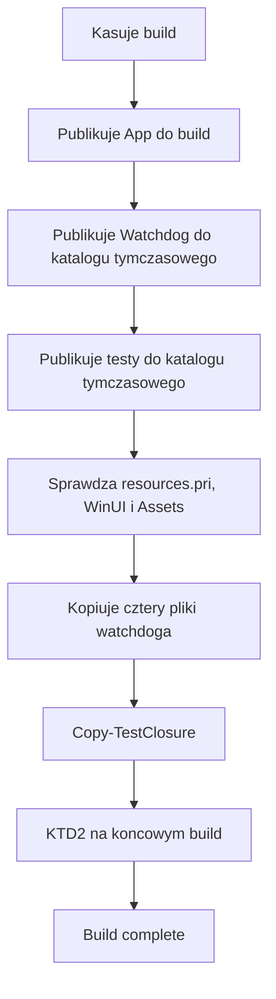
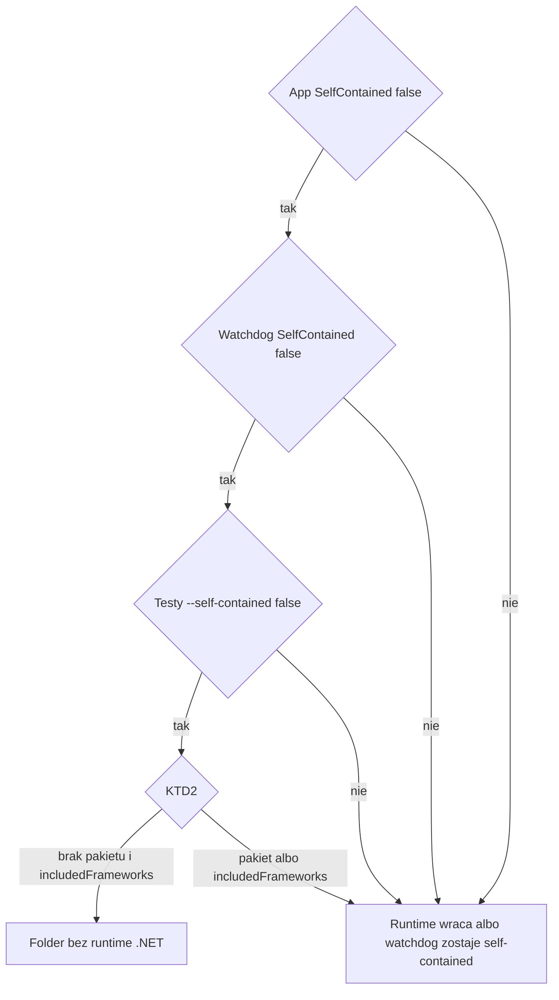

# Publikacja bez runtime .NET - Plan

## Goal Capsule

- **Objective:** Na drugim komputerze z Windows x64 skopiowany folder wydania uruchamia RbxDisplay po instalacji runtime .NET, a sam folder nie wozi tego runtime.
- **Means:** publikacja framework-dependent dla .NET przy self-contained Windows App SDK (KTD1).
- **Authority:** zachowanie produktu jest na R1–R6. Mechanizm publikacji jest na KTD1 i KTD2. Jednostka nie zmienia żadnego z tych zapisów.
- **Execution:** code.
- **Stop:** przerwać pracę, jeśli framework-dependent .NET nie daje się utrzymać przy `WindowsAppSDKSelfContained` albo jeśli program testowy w `build/` nie może być framework-dependent bez zepsucia `SelfTest.cmd`. Zebrane źródła tego progu nie osiągają.
- **Kto kończy:** implementacja idzie jednostkami U1, U2 i U3. Wydanie zostaje przy użytkowniku.

---

## Product Contract

### Summary

Folder `build/` przestaje zawierać runtime .NET. Aplikacja, watchdog i skopiowany program testowy są framework-dependent. Natywne pliki WinUI i Windows App SDK zostają obok exe, a bootstrapper Windows App SDK zostaje wyłączony. Dokumentacja mówi, że drugi komputer potrzebuje x64 .NET Runtime 10. Inne cięcia rozmiaru zostają propozycjami.

### Problem Frame

Dzisiejsza publikacja jest self-contained dla .NET, więc katalog `build/` wozi runtime razem z aplikacją. `BUILD.md`, `USAGE.md` i `Verification.md` opisują ten folder jako komplet, który na drugim komputerze nie wymaga instalacji runtime. Przez to paczka jest większa o pakiet `Microsoft.NETCore.App`, a obietnica „skopiuj folder” obejmuje też ten runtime.

### Requirements

**Publikacja**

- R1. Po `Build.ps1` katalog `build/` nie zawiera runtime .NET. Aplikacja, watchdog i skopiowany tam program testowy są framework-dependent.
- R2. Pliki WinUI i Windows App SDK zostają w tym katalogu obok exe. `WindowsAppSDKSelfContained` zostaje włączone. Bootstrapper Windows App SDK zostaje wyłączony.
- R3. `Build.ps1` kończy się błędem, gdy po `Copy-TestClosure` w `build/` jest pakiet runtime .NET albo którykolwiek z trzech plików `runtimeconfig.json` opisuje publikację self-contained.

**Uruchomienie**

- R4. Przy zainstalowanym x64 .NET Runtime 10 i przy plikach z R2 `RbxDisplay.exe` startuje, a start profilu dochodzi do watchdoga framework-dependent. Bez tego runtime apphost pokazuje dialog dla `Microsoft.NETCore.App`, zanim ruszy kod aplikacji.

**Dokumentacja**

- R5. Dokumentacja drugiego komputera wymaga x64 .NET Runtime 10, czyli frameworka `Microsoft.NETCore.App`. Zaznacza, że .NET Desktop Runtime też ten framework zawiera. Instalator Windows App SDK nie jest warunkiem uruchomienia. Maszyna budująca nadal potrzebuje SDK .NET 10. Każdy plik zostaje w swoim języku.
- R6. Przeniesienie aplikacji to kopia całej zawartości `build/`, razem z DLL, `Assets` i plikami zasobów. Start przeniesionego folderu to `RbxDisplay.exe`. Odtworzenie z tego folderu to `RbxDisplay.Watchdog.exe --restore`. `Start.cmd`, `Restore.cmd` i `SelfTest.cmd` zostają opakowaniami katalogu źródeł.

### Key Decisions

- **Runtime .NET wychodzi z folderu, natywne pliki WinUI zostają.** (session-settled: user-directed — chosen over dropping Windows App SDK self-contained as well, and over measuring both variants first: the user wants the .NET runtime out of the folder while WinUI natives stay beside the exe) Governs R1, R2, R4, R5.

### Success Criteria

Po `Build.cmd` katalog `build/` spełnia R1 i R2, a `SelfTest.cmd` na maszynie ze SDK uruchamia opublikowany program testowy. Czytelnik `BUILD.md` i `USAGE.md` umie z R5 i R6 powiedzieć, co instaluje drugi komputer i którego pliku exe używa po samej kopii `build/`.

### Acceptance Examples

- AE1. Covers R1, R3.
  - **Given:** aplikacja, watchdog i publikacja testów są framework-dependent.
  - **When:** `Build.ps1` kończy `Copy-TestClosure`.
  - **Then:** w `build/` nie ma `hostfxr.dll` ani `coreclr.dll`, trzy pliki `runtimeconfig.json` nazywają `Microsoft.NETCore.App`, a skrypt kończy się komunikatem o ukończonym buildzie.
- AE2. Covers R3.
  - **Given:** aplikacja i watchdog są framework-dependent, a publikacja testów w `Build.ps1` nadal przekazuje self-contained.
  - **When:** `Copy-TestClosure` dokłada pliki z deps.json testów.
  - **Then:** `hostfxr.dll` wraca do `build/` i skrypt przerywa build.
- AE3. Covers R3.
  - **Given:** aplikacja i testy są framework-dependent, a watchdog zostaje self-contained. Do `build/` trafiają tylko jego exe, dll, deps.json i runtimeconfig.json.
  - **When:** kontrola po closure ogląda `RbxDisplay.Watchdog.runtimeconfig.json`.
  - **Then:** plik zawiera `includedFrameworks`, `hostfxr.dll` może być nieobecny, a skrypt i tak przerywa build.
- AE4. Covers R2, R4.
  - **Given:** folder ma pliki WinUI wymagane przez `Build.ps1`, nie ma pakietu runtime .NET i na maszynie jest x64 .NET Runtime 10. Instalatora Windows App SDK nie ma.
  - **When:** użytkownik uruchamia `RbxDisplay.exe`.
  - **Then:** okno aplikacji się otwiera.
- AE5. Covers R4.
  - **Given:** na maszynie nie ma x64 `Microsoft.NETCore.App` 10.
  - **When:** użytkownik uruchamia `RbxDisplay.exe`.
  - **Then:** dialog apphosta wymienia `Microsoft.NETCore.App`. Kod zarządzany aplikacji nie startuje. Komunikaty `ResourceSetup` i `ProfileSession` o niepełnym folderze się nie pojawiają.
- AE6. Covers R6.
  - **Given:** na drugi komputer skopiowano tylko zawartość `build/`.
  - **When:** użytkownik szuka sposobu startu i odtworzenia.
  - **Then:** start to `RbxDisplay.exe`, a odtworzenie to `RbxDisplay.Watchdog.exe --restore`. `Start.cmd` nie leży w tym folderze.

### Scope Boundaries

Ta zmiana ustawia tryb publikacji .NET i opis tego trybu. Pętla `Copy-TestClosure` dalej kopiuje nazwy z grup `runtime` i `native`. `Directory.Build.props` zostaje przy wersji 2.0.1. `ProfileSession.cs`, `ResourceSetup.cs` i `MainWindow.cs` zostają bez zmian. Nowy projekt testowy nie powstaje.

### Deferred to Follow-Up Work

- Symbole PDB. Projekty nie ustawiają `DebugType` ani wyłączenia symboli przy publikacji. Jeśli Release faktycznie kopiuje PDB do `build/`, ich pominięcie zmniejsza folder. Ryzyko: trudniejsza diagnoza awarii na drugim komputerze.
- Satelity językowe WinUI. Target self-contained Windows App SDK kopiuje `*.mui` z drzewa natywnego komponentów, w tym lokalizacje WinUI. Wycięcie ich zmniejsza folder, który ta zmiana zostawia. Ryzyko: zlokalizowane zasoby kontrolek WinUI znikają na systemie innym niż en-US.
- Program testowy poza folderem wydania. `Copy-TestClosure` wkłada do `build/` exe testów oraz biblioteki Microsoft.Testing.Platform i xUnit, których gracz nie uruchamia. Ryzyko: `SelfTest.cmd` i opis programu testowego w folderze przestają działać, dopóki skrypt i dokumentacja nie wskażą nowego miejsca.
- Trimming. `PublishTrimmed` przy `dotnet publish` wymusza self-contained i cofa R1. Ryzyko: WinUI i XAML korzystają z refleksji, a przycięty build psuje start.
- Single-file. `PublishSingleFile` przy publikacji wymusza self-contained. Dokumentacja unpackaged WinUI nie wspiera single-file dla aplikacji framework-dependent. Ryzyko: runtime wraca do folderu, a walidacja Windows App SDK ostrzega.
- ReadyToRun. Dla `net8.0` i nowszych, w tym `net10.0`, ReadyToRun nie wymusza self-contained, więc da się je włączyć później. Ryzyko: obok IL zostaje kod natywny i folder zwykle rośnie, a runtime i tak musi być zainstalowany.
- MSIX. To inny model niż kopia folderu przy `WindowsPackageType` None. Ryzyko: podpis, instalacja pakietu i odejście od dzisiejszego układu katalogu.
- Rezygnacja z self-contained Windows App SDK. W folderze zostaje ładunek meta-pakietu `Microsoft.WindowsAppSDK` 2.5.1, w tym natywne WinUI. To większe cięcie niż sam runtime .NET. Ryzyko: drugi komputer potrzebuje zainstalowanego Windows App SDK, a ta zmiana celowo nie włącza bootstrappera. Wariant został odrzucony przy ustalaniu zakresu.
- Nieużywane komponenty tego meta-pakietu. Restore aplikacji ciągnie m.in. WebView2 oraz Windows AI / ONNX, a tryb self-contained kopiuje ich pliki natywne, w tym `WebView2Loader.dll`, `DirectML.dll` i `onnxruntime.dll`. Ryzyko: odcięcie komponentu, z którego aplikacja jednak korzysta, psuje funkcję, której ten plan nie sprawdzał.
- Zdanie w `MainWindow.cs` o `Restore.cmd`. Dialog po niepełnym odtworzeniu sesji każe użyć `Restore.cmd`, którego nie ma w samej kopii `build/`. Ryzyko: zmiana tekstu myli osobę, która uruchamia aplikację z drzewa źródeł, jeśli dokumentacja z R6 nie jest jeszcze jedyną instrukcją.

---

## Planning Contract

### Key Technical Decisions

- KTD1. **Trzy exe są framework-dependent, a Windows App SDK zostaje w folderze.** (session-settled: user-directed — chosen over dropping Windows App SDK self-contained as well, and over measuring both variants first: the user wants the .NET runtime out of the folder while WinUI natives stay beside the exe) Realizuje R1, R2, R4 i R5.
  Aplikacja i watchdog mają dziś `<SelfContained>true</SelfContained>` oraz `RuntimeIdentifier` `win-x64`. Publikacja testów w `Build.ps1` przekazuje `--self-contained true`. Te trzy miejsca ustawiają jawne `false`. Samo skasowanie właściwości na `net10.0` też dałoby framework-dependent, bo od .NET 8 sam RID tego nie wymusza, ale jawne `false` zostaje w plikach, które dziś wymuszają `true`.
  `WindowsAppSDKSelfContained` zostaje `true`, `WindowsAppSDKBootstrapInitialize` zostaje `false`, `WindowsPackageType` zostaje `None`, `PublishSingleFile` zostaje `false`. `WindowsAppSdkUndockedRegFreeWinRTInitialize` zostaje nieustawione. `PublishTrimmed` i `PublishAot` zostają nieustawione.
  `Copy-TestClosure` bez zmiany grup kopiuje nazwy z `runtime` i `native` w deps.json testów. Pakiet runtime znika z tej listy, gdy publikacja testów jest framework-dependent. Biblioteki testowe dalej tą drogą wchodzą do `build/`.
  Połączenie jest wykonalne. Target `Microsoft.WindowsAppSDK.SelfContained.targets` kopiuje ładunek natywny i nie ustawia właściwości .NET `SelfContained`. Przewodnik Microsoftu mówi, że aplikacja .NET jest w pełni self-contained dopiero wtedy, gdy oba tryby są self-contained. Ta zmiana świadomie zostawia aplikację niepełnie self-contained: z folderu wychodzi pakiet `Microsoft.NETCore.App`, a ładunek Windows App SDK zostaje. To jest mniejszy zysk rozmiaru niż odrzucone cięcie Windows App SDK.
  Sesja zakładała na drugim komputerze .NET 10 Desktop Runtime. Restore aplikacji dla `net10.0-windows10.0.19041.0` ma we `frameworkReferences` tylko `Microsoft.NETCore.App` i pakiet referencyjny `Microsoft.Windows.SDK.NET.Ref.Windows`. `UseWPF` i `UseWindowsForms` są wyłączone, więc `Microsoft.WindowsDesktop.App` nie wchodzi do `runtimeconfig.json`. Produkt do opisania to x64 .NET Runtime. .NET Desktop Runtime zawiera `Microsoft.NETCore.App`, więc też spełnia R4. Nie jest frameworkiem, o który prosi aplikacja. `downloadDependencies` wymienia też runtime Desktop i ASP.NET, bo SDK je pobiera przy RID. To nie jest lista frameworków w `runtimeconfig.json`.
  Drugiego mechanizmu nie było czego rozgrywać. Kształt ustalił użytkownik, a wariant z pomiarem obu cięć przed wyborem oraz wariant bez self-contained Windows App SDK są poza tą zmianą.
- KTD2. **Kontrola końcowego `build/` jest w `Build.ps1`, za `Copy-TestClosure`.** Realizuje R3.
  Dzisiejsza lista wymaganych plików jest przed closure i nie zawiera plików pakietu runtime, więc przechodzi zarówno przy framework-dependent, jak i po powrocie runtime. Żaden test w `tests/RbxDisplay.Core.Tests/` nie ogląda `build/`.
  Po closure skrypt przerywa build, gdy w `build/` leży `hostfxr.dll`, `hostpolicy.dll`, `coreclr.dll` albo `System.Private.CoreLib.dll`. Przerywa też, gdy `RbxDisplay.runtimeconfig.json`, `RbxDisplay.Watchdog.runtimeconfig.json` albo `RbxDisplay.Core.Tests.runtimeconfig.json` zawiera `includedFrameworks` albo nie nazywa frameworka `Microsoft.NETCore.App`. Na tym samym końcowym folderze zostają spełnione nazwy, których `Build.ps1` już wymaga, w tym `resources.pri`, `Microsoft.UI.Xaml.Controls.dll`, `Microsoft.WinUI.dll` oraz `Assets/RbxDisplay.ico` i `Assets/RbxDisplay.png`.
  Apphost szuka `hostfxr.dll` najpierw w katalogu aplikacji. Plik z pakietu self-contained w tym katalogu jest hostem dla wszystkich trzech exe. Kontrola braku `hostfxr.dll` jest dlatego częścią R3, a nie tylko ozdobą rozmiaru. Sam brak `hostfxr.dll` nie wyłapuje watchdoga self-contained skopiowanego jako cztery pliki. To wyłapuje `includedFrameworks` w jego `runtimeconfig.json`.

### High-Level Technical Design

`Build.ps1` kasuje `build/`, publikuje trzy programy i dopiero na końcu składa jeden folder. Kontrola z KTD2 stoi za `Copy-TestClosure`, bo wcześniejsza lista nie widzi plików, które closure dokłada.

Trzy przełączniki są niezależne. Closure dokłada brakujące pliki i nie usuwa plików, które publikacja aplikacji już położyła. Zielony build przy częściowym przełączeniu łamie R1 albo R4.

### Assumptions

- Jawne `false` na projekcie testów i flaga `--self-contained false` w `Build.ps1` stoją razem. Sama właściwość w csproj nie przebija dzisiejszej flagi `true` w skrypcie.
- `dotnet test` w `Build.ps1` zostaje bez `-r` i bez `--self-contained`.
- Roll-forward zostaje domyślny `Minor`. Plan nie ustawia `RuntimeFrameworkVersion` ani `RollForward`. Wystarczy stabilny x64 .NET 10. Patch 10.0.12 z obecnego restore nie jest progiem dla drugiego komputera.
- Bramką automatyczną jest KTD2 plus `SelfTest.cmd` na maszynie, która ma SDK .NET 10. Osobny komputer bez SDK zostaje ręcznym sprawdzeniem, nie warunkiem ukończenia jednostek.
- `Start.cmd`, `Restore.cmd` i `SelfTest.cmd` zostają w katalogu źródeł. Ich ścieżki `%~dp0build` działają tylko stamtąd. Plan ich nie przenosi do `build/`.
- Akapit w `Verification.md` o indeksie PRI na Linuxie i o `makepri.exe` zostaje. Zmiana csproj i tak obejmie każdą publikację aplikacji i watchdoga, nie tylko `Build.ps1`.

### Sequencing

U1 i U2 lądują jako jedna zmiana. Samo U1 nadal drukuje ukończenie buildu, bo dzisiejsza lista plików jest przed closure. U3 opisuje zachowanie z KTD1 i może iść zaraz po tym, jak U1 ustali trzy flagi.

### Risks & Dependencies

| Ryzyko | Skutek | Ograniczenie |
| --- | --- | --- |
| Przełączony tylko jeden z trzech programów | Build wygląda na ukończony, folder znowu ma runtime albo watchdog pada przy starcie profilu | U2 w tej samej zmianie co U1, według KTD2 |
| Późniejsze `PublishSingleFile`, `PublishTrimmed` albo `PublishAot` | Publikacja z powrotem staje się self-contained | Zostają wyłączone albo nieustawione, KTD1 |
| Opisany instalator Desktop Runtime jako jedyny | Dialog apphosta i tak wymienia `Microsoft.NETCore.App` | R5 nazywa .NET Runtime i dopowiada, że Desktop Runtime też go zawiera |
| `DOTNET_ROOT` wskazuje pusty albo stary katalog | Apphost omija `Program Files\dotnet` | Poza tekstem R5. Nie dodawać nowego rozdziału diagnostycznego |
| Oczekiwanie, że folder skurczy się o cały ładunek WinUI | Zostaje self-contained Windows App SDK | KTD1. Większe cięcia są w Deferred to Follow-Up Work |

Zależność zewnętrzna: SDK .NET 10 na maszynie budującej, zgodnie z `global.json` (`10.0.100`, `rollForward` `latestFeature`). Drugi komputer potrzebuje runtime, nie SDK.

### System-Wide Impact

Każda publikacja `src/RbxDisplay.App/RbxDisplay.App.csproj` i `src/RbxDisplay.Watchdog/RbxDisplay.Watchdog.csproj` staje się framework-dependent, także poza `Build.ps1`. `ProfileSession` uruchamia `RbxDisplay.Watchdog.exe` z katalogu aplikacji, bez okna, i przez pięć sekund czeka na plik ready. Watchdog self-contained skopiowany jako cztery pliki kończy się istniejącym wyjątkiem „The watchdog process could not start.” albo „The watchdog process did not confirm readiness.”, już po starcie okna. Brak runtime na maszynie zatrzymuje się wcześniej, na dialogu apphosta, i nie dochodzi do tych zdań. `ResourceSetup` i zdanie o całym folderze w `ProfileSession` dalej dotyczą niepełnej kopii, gdy runtime już jest.

### Sources

- `src/RbxDisplay.App/RbxDisplay.App.csproj` — `SelfContained`, `WindowsAppSDKSelfContained`, `WindowsAppSDKBootstrapInitialize`, `PublishSingleFile`, pakiet `Microsoft.WindowsAppSDK` 2.5.1.
- `src/RbxDisplay.Watchdog/RbxDisplay.Watchdog.csproj` — `SelfContained` i `RuntimeIdentifier` `win-x64`, bez właściwości Windows App SDK.
- `tests/RbxDisplay.Core.Tests/RbxDisplay.Core.Tests.csproj` — `net10.0`, `UseMicrosoftTestingPlatformRunner`, brak `SelfContained`.
- `Build.ps1` — trzy publikacje, lista wymaganych plików, kopia czterech plików watchdoga, `Copy-TestClosure`.
- `SelfTest.cmd`, `Start.cmd`, `Restore.cmd` — wejścia z katalogu źródeł do `build\`.
- Restore aplikacji, `frameworkReferences` dla `net10.0-windows10.0.19041.0`: `Microsoft.NETCore.App` i `Microsoft.Windows.SDK.NET.Ref.Windows`.
- [Windows App SDK self-contained deployment](https://learn.microsoft.com/en-us/windows/apps/package-and-deploy/self-contained-deploy/deploy-self-contained-apps) — w pełni self-contained oznacza też self-contained .NET. Same przełączniki są osobne.
- [Runtime-specific apps no longer self-contained](https://learn.microsoft.com/en-us/dotnet/core/compatibility/sdk/8.0/runtimespecific-app-default) — od .NET 8 sam RID nie włącza self-contained. `PublishSingleFile`, `PublishTrimmed` i `PublishAot` przy publikacji nadal je włączają.
- [Install .NET on Windows](https://learn.microsoft.com/en-us/dotnet/core/install/windows) — .NET Runtime kontra .NET Desktop Runtime.
- [Troubleshoot app launch](https://learn.microsoft.com/en-us/dotnet/core/runtime-discovery/troubleshoot-app-launch) — dialog braku frameworka `Microsoft.NETCore.App`.

---

## Implementation Units

### U1. Trzy programy bez runtime .NET

- **Goal:** Aplikacja, watchdog i program testowy publikują się jako framework-dependent, a ładunek Windows App SDK zostaje przy exe.
- **Requirements:** R1, R2, KTD1.
- **Dependencies:** brak.
- **Files:**
  - `src/RbxDisplay.App/RbxDisplay.App.csproj`
  - `src/RbxDisplay.Watchdog/RbxDisplay.Watchdog.csproj`
  - `tests/RbxDisplay.Core.Tests/RbxDisplay.Core.Tests.csproj`
  - `Build.ps1`
- **Approach:**
  1. W csproj aplikacji i watchdoga ustaw `SelfContained` na false. Zostaw `RuntimeIdentifier` `win-x64`.
  2. Na aplikacji zostaw `WindowsAppSDKSelfContained` true, `WindowsAppSDKBootstrapInitialize` false, `WindowsPackageType` None i `PublishSingleFile` false. Nie ustawiaj `WindowsAppSdkUndockedRegFreeWinRTInitialize`.
  3. W csproj testów ustaw `SelfContained` na false. W `Build.ps1` zamień `--self-contained true` na `--self-contained false` i zostaw `-r win-x64`.
  4. Zostaw pętlę `Copy-TestClosure` i cztery kopiowane pliki watchdoga. Zostaw `dotnet test` bez RID i bez flagi self-contained.
- **Execution note:** To jest zmiana publikacji. Dowód to kontrola folderu z U2, nie nowy test jednostkowy. U1 bez U2 nie zamyka R1.
- **Patterns to follow:** istniejąca grupa właściwości w obu csproj oraz argumenty `dotnet publish` już obecne w `Build.ps1`.
- **Test scenarios:**
  - Publikacja aplikacji z `SelfContained` false i RID `win-x64` daje `RbxDisplay.runtimeconfig.json` z frameworkiem `Microsoft.NETCore.App`, bez `includedFrameworks`. W wyjściu są `resources.pri`, `Microsoft.UI.Xaml.Controls.dll`, `Microsoft.WinUI.dll` i `Assets/RbxDisplay.ico`. Nie ma `hostfxr.dll`.
  - Publikacja watchdoga w tym samym trybie daje `runtimeconfig.json` z `Microsoft.NETCore.App` i bez `hostfxr.dll` w katalogu etapu. Do `build/` nadal wchodzą tylko exe, dll, deps.json i runtimeconfig.json.
  - Publikacja testów z `-r win-x64` i `--self-contained false` daje `RbxDisplay.Core.Tests.exe` oraz biblioteki z grupy `runtime` w deps.json, w tym zestaw xUnit i Microsoft.Testing.Platform. W etapie testów nie ma `coreclr.dll`.
  - `Copy-TestClosure` po takiej publikacji kopiuje te biblioteki testowe do `build/` i pomija brakujący plik `_._`, jeśli deps.json go wymienia, a pliku nie ma.
  - Brak `resources.pri` po publikacji aplikacji nadal przerywa `Build.ps1` przed kopią watchdoga, tak jak dziś.
- **Verification:** Trzy publikacje są framework-dependent, a pliki WinUI wymagane przez skrypt nadal powstają przy aplikacji. R1 na złożonym `build/` potwierdza dopiero U2.

### U2. Blokada powrotu runtime do build

- **Goal:** `Build.ps1` odrzuca końcowy `build/`, jeśli pakiet runtime .NET wrócił albo któryś exe został self-contained.
- **Requirements:** R3, KTD2.
- **Dependencies:** U1.
- **Files:**
  - `Build.ps1`
- **Approach:**
  1. Zostaw obecną listę wymaganych plików przed closure.
  2. Za `Copy-TestClosure` przerwij build, gdy końcowy folder łamie KTD2.
  3. Nie dodawaj projektu testowego. Istniejące testy xUnit nie widzą `build/`.
- **Execution note:** Ta sama zmiana co U1. Kontrola folderu jest dowodem publikacji. `dotnet test` jej nie zastępuje.
- **Patterns to follow:** istniejące `Test-Path` i przerwanie skryptu przy braku wymaganego pliku.
- **Test scenarios:**
  - Covers AE1. Po U1 końcowy `build/` nie zawiera `hostfxr.dll`, `hostpolicy.dll`, `coreclr.dll` ani `System.Private.CoreLib.dll`. Trzy `runtimeconfig.json` nazywają `Microsoft.NETCore.App` i nie zawierają `includedFrameworks`. Pliki już wymagane przez skrypt, w tym `resources.pri` i `Assets/RbxDisplay.png`, nadal są. Skrypt kończy build.
  - Covers AE2. Aplikacja i watchdog są framework-dependent, a argument testów zostaje `--self-contained true`. Po closure `hostfxr.dll` jest w `build/` i skrypt przerywa build.
  - Covers AE3. Watchdog zostaje self-contained, aplikacja i testy są framework-dependent. `RbxDisplay.Watchdog.runtimeconfig.json` zawiera `includedFrameworks`. Skrypt przerywa build także wtedy, gdy `hostfxr.dll` nie został skopiowany.
  - Aplikacja zostaje self-contained, a watchdog i testy są framework-dependent. `hostfxr.dll` leży w `build/` już po publikacji aplikacji i skrypt przerywa build. Closure nie usuwa tego pliku.
  - `SelfTest.cmd` na maszynie ze SDK .NET 10 uruchamia `build\RbxDisplay.Core.Tests.exe` i kończy zestaw. Ten przebieg przechodzi także przy folderze, który nadal ma runtime, więc sam nie zastępuje kontroli KTD2.
  - `dotnet test` projektu `tests/RbxDisplay.Core.Tests/RbxDisplay.Core.Tests.csproj` w Release przechodzi i nie czyta `build/`.
- **Verification:** Częściowy przełącznik z AE2 i AE3 przerywa `Build.ps1`. Pełne U1 daje ukończony build i folder zgodny z KTD2.

### U3. Dokumentacja wymogu runtime

- **Goal:** Czytelnik każdego pliku użytkownika wie, że drugi komputer instaluje x64 .NET Runtime 10, a kopia `build/` nadal trzyma natywne WinUI obok exe.
- **Requirements:** R5, R6, KTD1.
- **Dependencies:** U1.
- **Files:**
  - `BUILD.md`
  - `USAGE.md`
  - `README.md`
  - `Verification.md`
- **Approach:**
  1. W `BUILD.md` po polsku zastąp zdanie, że projekt publikuje .NET i Windows App SDK razem z aplikacją. Zostaw wymóg SDK .NET 10 dla osoby budującej, wymóg całego katalogu `build/` oraz zdanie, że natywne zależności WinUI zostają obok exe. Dopisz x64 .NET Runtime 10 dla komputera, który ten katalog uruchamia, i jedno zdanie, że .NET Desktop Runtime też zawiera `Microsoft.NETCore.App`. Napisz, że instalator Windows App SDK nie jest potrzebny.
  2. W `USAGE.md` po angielsku zostaw polecenie trzymania exe, DLL, Assets i zasobów razem. Zostaw zdanie, że SDK nie jest potrzebny na komputerze z gotową aplikacją, i dopisz obok niego runtime z R5, żeby nie brzmiało jak brak jakiejkolwiek instalacji .NET. Zastąp zdanie, że dystrybucja zawiera runtime .NET 10 i Windows App SDK. Start przeniesionego folderu opisz jako `RbxDisplay.exe`, a odtworzenie jako `RbxDisplay.Watchdog.exe --restore`. `Start.cmd`, `Restore.cmd` i `SelfTest.cmd` opisz jako polecenia drzewa źródeł. Zostaw link do dokumentacji self-contained Windows App SDK.
  3. W `README.md` po angielsku popraw zdanie o zależnościach runtime produkowanych przez build tak, żeby dotyczyło plików WinUI z buildu, a runtime .NET było instalacją na maszynie.
  4. W `Verification.md` po angielsku popraw zdanie o publikacji z plikami runtime tak, żeby nie twierdziło, że pakiet .NET leży w folderze. Zostaw akapit o Linuxie i `makepri.exe`. Lista walidacji na Windowsie może nadal wymieniać `Restore.cmd`, jeśli widać, że to sprawdzenie z drzewa źródeł.
- **Patterns to follow:** polski `BUILD.md` oraz angielski `USAGE.md`, `README.md` i `Verification.md`. Nie wklejaj angielskiego zdania z `USAGE.md` do `BUILD.md`.
- **Test scenarios:**
  - Czytelnik `BUILD.md` odróżnia SDK na maszynie budującej od x64 .NET Runtime 10 na drugim komputerze i czyta, że natywne WinUI zostają obok exe.
  - Czytelnik `USAGE.md` po samym „No .NET SDK is required” widzi też wymóg runtime z R5 i nie dostaje zdania, że folder zawiera runtime .NET 10 oraz Windows App SDK.
  - Czytelnik, który dostał tylko zawartość `build/`, znajduje w `USAGE.md` start przez `RbxDisplay.exe` i odtworzenie przez `RbxDisplay.Watchdog.exe --restore`.
  - `README.md` nie mówi, że build wkłada runtime .NET do folderu.
  - `Verification.md` nie mówi, że opublikowany folder zawiera pliki runtime .NET. Akapit o pierwszym uruchomieniu i `makepri.exe` na ścieżce linuxowej zostaje.
- **Verification:** Cztery pliki spełniają R5 i R6 w swoim języku. Link self-contained Windows App SDK w `USAGE.md` zostaje. Pliki C# z komunikatami o folderze zostają nietknięte.

---

## Verification Contract

| Bramka | Wejście | Co potwierdza |
| --- | --- | --- |
| Publikacja | `Build.cmd`, czyli `Build.ps1` | Najpierw `dotnet test` projektu `tests/RbxDisplay.Core.Tests/RbxDisplay.Core.Tests.csproj` w Release, potem publikacja. Po U2 skrypt przerywa build, gdy końcowy `build/` łamie KTD2, i kończy build, gdy U1 i U2 są razem |
| Program testowy w folderze | `SelfTest.cmd` | `build\RbxDisplay.Core.Tests.exe` startuje na maszynie ze SDK .NET 10. Nie potwierdza braku `hostfxr.dll` |
| Testy logiki | ten sam `dotnet test` | Zachowanie rdzenia zostaje. Nie ogląda `build/` |
| Drugi komputer | ręcznie, poza bramką | x64 .NET Runtime 10 bez instalatora Windows App SDK, start `RbxDisplay.exe` według AE4. Brak tego runtime daje AE5 |

Nowego zestawu testów xUnit nie dodawać. Istniejące testy nie zawierają asercji self-contained.

---

## Definition of Done

- U1, U2 i U3 są w drzewie razem. Samo U1 bez kontroli KTD2 nie domyka R1.
- Końcowy `build/` po `Build.cmd` nie zawiera plików pakietu runtime nazwanych w KTD2, zawiera pliki WinUI już wymagane przez `Build.ps1` i ma trzy `runtimeconfig.json` framework-dependent.
- `SelfTest.cmd` na maszynie ze SDK kończy opublikowany program testowy.
- `BUILD.md`, `USAGE.md`, `README.md` i `Verification.md` spełniają R5 i R6.
- `WindowsAppSDKSelfContained` zostaje true, a bootstrapper zostaje wyłączony.
- Żadne cięcie z Deferred to Follow-Up Work nie weszło do tej zmiany.
- W difie nie zostają flagi ani pliki z porzuconej próby publikacji, w tym tymczasowy katalog etapu i przywrócone `SelfContained` true.
